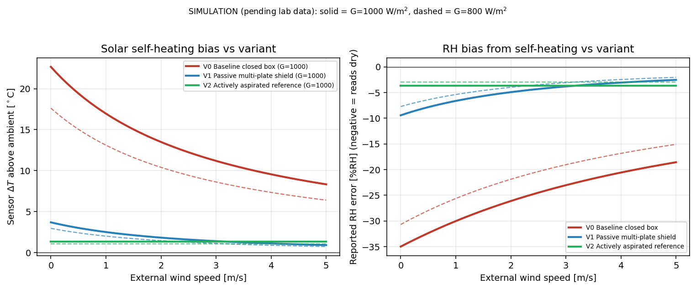
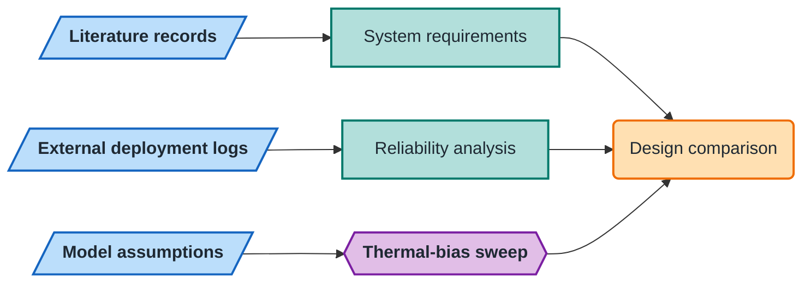

# Enclosure Research

**A research toolkit for evaluating low-cost outdoor sensor boxes across
sensing, enclosure, power, firmware, calibration, and field reliability.**

[](https://github.com/500ft/Enclosure-Research/actions/workflows/ci.yml)
[](https://www.python.org/)
[](literature/literature_matrix.csv)

**[Results](docs/results.md) · [Reproduce](#reproduce-the-analysis) · [Data and figures](docs/data-and-figures.md) · [Manuscript](paper/manuscript_v1.md)**



*Analytical temperature and relative-humidity bias under solar loading. See the
[results](docs/results.md) for interpretation and [figure lineage](docs/data-and-figures.md)
for inputs, assumptions, and generation commands.*

## Overview

Outdoor sensor performance depends on the complete deployed system, not only a
sensor datasheet. This repository connects four evidence paths:

- a 26-source literature matrix;
- reliability analysis for exported deployment logs;
- a first-order enclosure thermal-bias model; and
- templates and plans for calibration, CAD, and FEA work.

The current field-log summary is provisional because deployment history and raw
exports are maintained outside the repository. The thermal study is an
analytical model awaiting laboratory comparison.



*Shapes: parallelogram = input · rectangle = process · hexagon = core method · rounded = result.*

## Reproduce the analysis

Create an environment and regenerate the repository-contained checks and
thermal figure:

```bash
python -m venv .venv
source .venv/bin/activate
python -m pip install -r requirements.txt
python analysis/check_literature_coverage.py
python analysis/thermal_bias.py
```

Analyze the two deployment exports separately:

```bash
python analysis/analyze_deployment_logs.py \
  --data-dir /path/to/DataEnclosure \
  --out-dir analysis/output
```

The input directory must contain `data1.3_24 - Sheet1.csv` and
`data2_5_29 - Sheet1.csv`. Those raw files are not committed. The script writes
an audit report, four plots, and filtered subsets; see
[`docs/data-and-figures.md`](docs/data-and-figures.md) before interpreting them.

## Documentation

| Document | Purpose |
| --- | --- |
| [`docs/results.md`](docs/results.md) | Current field-log and model results, kept separate from the repository overview |
| [`docs/data-and-figures.md`](docs/data-and-figures.md) | Data sources, filters, equations, plot lineage, and reproduction boundaries |
| [`docs/figure-manifest.json`](docs/figure-manifest.json) | Machine-readable generator/input/output map for committed result figures |
| [`analysis/thermal_bias_results.md`](analysis/thermal_bias_results.md) | Full thermal-model assumptions and sensitivity results |
| [`paper/manuscript_v1.md`](paper/manuscript_v1.md) | Working paper |
| [`literature/literature_matrix.csv`](literature/literature_matrix.csv) | Source-level evidence extraction |
| [`docs/cad_fea_plan.md`](docs/cad_fea_plan.md) | Planned geometry and solver work |

## Status

- **Done (literature):** 26-source literature matrix, per-source pros/cons
  analyses, and a cross-source synthesis.
- **Done (model):** first-order analytical thermal-bias model with a
  sensitivity sweep; every number is a simulation output, not a measurement.
- **Provisional (external logs):** reliability audit of two deployment-log
  exports kept outside the repository; delivery and continuity metrics only,
  no accuracy claims.
- **Pending:** heat-soak, reference co-location, and CHT/FEA comparisons are
  planned but not started; no experimental accuracy or calibration results
  exist yet. See [`docs/cad_fea_plan.md`](docs/cad_fea_plan.md).

## Repository map

```text
analysis/      data checks, reliability analysis, thermal model, and figures
literature/    source matrix and cross-source comparisons
ProConsList/   sensor and enclosure assessment for each bibliography entry
paper/         manuscript source and bibliography
templates/     baseline, deployment, and calibration data templates
deliverables/  rendered reports and summaries
docs/          results, provenance, and plans
```

## Contributing

See [`CONTRIBUTING.md`](CONTRIBUTING.md). Literature changes must update the
bibliography, matrix, summary, and corresponding `ProConsList/` entry together.

## License

No open-source license is included. Contact the repository owner before reuse
beyond the permissions provided by copyright law.
