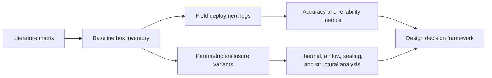

# Enclosure Research

[](https://github.com/500ft/Enclosure-Research/actions/workflows/ci.yml)
[](https://www.python.org/)
[](literature/literature_matrix.csv)

A research and analysis toolkit for evaluating low-cost outdoor sensor boxes as
complete deployed systems: sensors, enclosure, power, firmware, calibration,
and maintenance.

**[Results](#current-results) · [Quick start](#quick-start) · [Workflow](#study-workflow) · [Documentation](#documentation) · [Contributing](#contributing)**


*First-order simulation of temperature and relative-humidity bias for a closed
box, a passive radiation shield, and an aspirated reference. Lab comparison is
still pending.*

## Overview

An outdoor sensor can meet its datasheet specification and still produce poor
field data after solar heating, restricted airflow, water ingress, power loss,
or upload failures are introduced by the assembled box. This project combines
literature review, field-log analysis, calibration templates, and CAD/FEA plans
so enclosure decisions can be evaluated at system level.

| | |
| --- | --- |
| **Project stage** | V1 manuscript and preliminary field-log analysis |
| **Literature set** | 26 sources with matching sensor and enclosure notes |
| **Field window** | Provisional 22-day unattended outdoor deployment |
| **Design comparison** | Closed box, passive shield, and aspirated reference |
| **Pending work** | Reference co-location, lab inventory, CAD, and FEA |

## Current results

### Preliminary field-log summary

The current manuscript reports the following provisional values from the first
deployment-log audit:

| Metric | Result |
| --- | ---: |
| Outdoor observation window | 22 days |
| Upload success | 95.7% |
| Data completeness | 91.4% |
| Outdoor brownout resets | 0 |

The raw deployment export is not included in this repository. Accuracy and
calibration results remain pending until reference co-location data are
available.

### Thermal model

At `G = 1000 W/m²` over `0–5 m/s` wind, the analytical model predicts:

| Variant | Temperature rise | Relative-humidity error |
| --- | ---: | ---: |
| Closed baseline box | 8.3–22.7 °C | −18.6 to −35.0 %RH |
| Passive multi-plate shield | 0.9–3.7 °C | −2.5 to −9.4 %RH |
| Aspirated reference | about 1.3 °C | about −3.7 %RH |

These values are simulation outputs. Inputs, sensitivity checks, and literature
brackets are documented in
[`analysis/thermal_bias_results.md`](analysis/thermal_bias_results.md).

| Field reliability | Deployment diagnostics |
| --- | --- |
|  |  |

## Study workflow



Every bibliography entry has a matching `ProConsList/` record covering the
sensor choice and the physical box or experimental setup. The CI check prevents
those records from drifting apart.

## Quick start

```bash
python -m venv .venv
source .venv/bin/activate
python -m pip install -r requirements.txt
python analysis/check_literature_coverage.py
python analysis/thermal_bias.py
```

Analyze an exported deployment-log directory with:

```bash
python analysis/analyze_deployment_logs.py \
  --data-dir /path/to/export \
  --out-dir analysis/output
```

The raw data path is supplied explicitly; the repository does not include the
lab's source export.

## Documentation

| Document | Purpose |
| --- | --- |
| [`paper/manuscript_v1.md`](paper/manuscript_v1.md) | Working paper and current field-log results |
| [`literature/literature_matrix.csv`](literature/literature_matrix.csv) | Source-level extraction matrix |
| [`literature/sensor_material_geometry_summary.md`](literature/sensor_material_geometry_summary.md) | Sensor, material, geometry, and setup comparison |
| [`ProConsList/README.md`](ProConsList/README.md) | Per-source review rules and template |
| [`docs/cad_fea_plan.md`](docs/cad_fea_plan.md) | Planned enclosure variants and analysis gates |
| [`templates/`](templates/) | Baseline inventory, deployment log, and calibration templates |
| [`deliverables/PI_Literature_Synthesis_Outdoor_Sensor_Box.pdf`](deliverables/PI_Literature_Synthesis_Outdoor_Sensor_Box.pdf) | 26-source PI literature synthesis |
| [`ROADMAP.md`](ROADMAP.md) | Milestones and remaining lab inputs |

## Repository map

```text
analysis/      metrics, deployment-log analysis, thermal model, and figures
literature/    source matrix and cross-source comparison tables
ProConsList/   one sensor/enclosure assessment per bibliography entry
paper/         manuscript source and bibliography
templates/     structured files for the next lab deployment
deliverables/  PI-facing reports and rendered summaries
docs/          CAD/FEA plan and review notes
```

## Contributing

See [`CONTRIBUTING.md`](CONTRIBUTING.md). Literature contributions must update
the bibliography, literature matrix, summary, and matching `ProConsList/` file
in the same change.

## License

No open-source license file is currently included. Contact the repository owner
before reusing code, figures, or document content outside the permissions
provided by copyright law.
