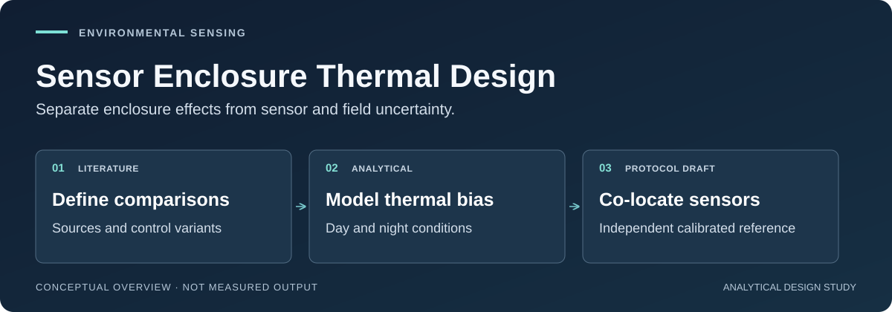

# Sensor Enclosure Thermal Design

**Separating enclosure-induced sensor bias from the weather being measured:
analytical models, traceable literature, and a testable day/night pilot.**

[](https://github.com/500ft/sensor-enclosure-thermal-design/actions/workflows/ci.yml)
[](docs/results.md)
[](.github/workflows/ci.yml)

[Start here](docs/START_HERE.md) · [Evidence](#evidence-snapshot) ·
[Quick start](#quick-start) · [Documentation](#documentation) ·
[Pilot protocol](docs/COLOCATION_PROTOCOL.md)



*Conceptual study map. Thermal outputs are analytical predictions; the physical
pilot is a draft, not an approved or completed experiment.*

## About

An outdoor sensor can report its enclosure's thermal environment instead of the
ambient air temperature. Solar absorption, airflow, internal heat, and radiation
all matter. This project compares enclosure choices and prepares the evidence
needed to decide whether a more complicated shield earns its cost.

The repository contains a first-order heat-balance model, a 26-source literature
matrix, deployment-reliability analysis, and a guarded intake route for a future
reference co-location pilot. It deliberately keeps **model predictions,
external-log observations, and proposed measurements separate**.

| Engineering question | Current answer or boundary |
| --- | --- |
| How much improvement comes from surface finish alone? | A painted-box control is included in the analytical comparison |
| Is midday enough for a first comparison? | No; modeled bias can change sign at night, motivating a full-day pilot |
| Does good delivery mean good measurement accuracy? | No; reliability accounting and reference-temperature agreement are separate |
| Has this enclosure been thermally validated? | No; calibration and physical co-location remain pending |

## Evidence snapshot

| Evidence path | What is available | What it does not establish |
| --- | --- | --- |
| Literature | [26-source matrix](literature/literature_matrix.csv), [bibliography](paper/references.bib), and [source assessments](ProConsList/README.md) | Measurements of this enclosure |
| Thermal model | [Equations and assumptions](analysis/thermal_bias_results.md), [day table](analysis/output/thermal_bias_table.csv), and [night table](analysis/output/thermal_bias_night_table.csv) | FEA, calibrated prediction, or physical validation |
| Reliability accounting | [Schedule-aware metrics](docs/RELIABILITY_METRICS.md) and regression tests | Reproduction of historical percentages without the external raw logs and deployment history |
| Pilot preparation | [24-hour protocol draft](docs/COLOCATION_PROTOCOL.md) and [intake checker](analysis/colocation_intake.py) | PI permission, acquired measurements, or an approved campaign |

At `G = 1000 W/m²` and `wind = 0.5 m/s`, the model predicts temperature rises of
**19.4 °C** for the dark box, **4.5 °C** for the same box painted white, and
**3.0 °C** for the passive shield. The incremental modeled improvement over paint
is about **1.5 °C**, not the 16.4 °C dark-box contrast. Geometry, heat coupling,
and convection also differ, so this is a system comparison—not an isolated
shielding effect. [Source and interpretation](docs/results.md#thermal-bias-model).


*Committed analytical-model output, not a field measurement. The painted control
is included in the default figure and table. See [figure lineage](docs/data-and-figures.md#thermal-bias-plot)
before interpreting the comparison.*

## Quick start

Python 3.11 is the CI target. These first-run checks use repository-contained
inputs and do not require private deployment exports or lab equipment.

```bash
git clone https://github.com/500ft/sensor-enclosure-thermal-design.git
cd sensor-enclosure-thermal-design
python -m venv .venv
source .venv/bin/activate
python -m pip install -r requirements.txt
python -m compileall -q analysis
PYTHONPATH=. python -m unittest discover -s analysis/tests -v
python analysis/check_literature_coverage.py
```

To regenerate the analytical tables **without replacing committed outputs**:

```bash
OUT_DIR="$(mktemp -d)"
python analysis/thermal_bias.py --no-figure \
  --table "$OUT_DIR/thermal-day.csv" \
  --night-table "$OUT_DIR/thermal-night.csv"
diff -u analysis/output/thermal_bias_table.csv "$OUT_DIR/thermal-day.csv"
diff -u analysis/output/thermal_bias_night_table.csv "$OUT_DIR/thermal-night.csv"
```

No diff means the tables reproduce for that environment. It does not validate
their assumptions. The [reading guide](docs/START_HERE.md#reviewer-reproduce-the-contained-analysis)
covers runtime provenance, external-data prerequisites, and the intake exits.

## Documentation

| Start with | What it answers |
| --- | --- |
| [Reading guide](docs/START_HERE.md) | Where should a recruiter, reviewer, or contributor begin? |
| [Results](docs/results.md) | Which outputs are modeled, provisional, or unavailable? |
| [Data and figures](docs/data-and-figures.md) · [Figure manifest](docs/figure-manifest.json) | Where did each plot and input come from? |
| [Model assumptions](analysis/thermal_bias_results.md) | Which geometry, radiation, and convection terms drive the comparison? |
| [Pilot protocol](docs/COLOCATION_PROTOCOL.md) | What must be specified before any physical comparison? |
| [Reliability definitions](docs/RELIABILITY_METRICS.md) · [Provenance request](docs/DEPLOYMENT_PROVENANCE_REQUEST.md) | Which denominators and external records are needed? |
| [Working manuscript](paper/manuscript_v1.md) | How are the literature and analysis assembled? |
| [CAD/FEA plan](docs/cad_fea_plan.md) | What geometry and higher-fidelity work remain proposed? |
| [Review index](docs/REVIEW_READY.md) | Which checks and counterexamples can another reviewer reproduce? |

```text
analysis/      thermal and reliability models, intake checks, tests, and figures
literature/    source matrix and cross-source design comparisons
ProConsList/   source-by-source evidence assessment
paper/         working manuscript and bibliography
templates/     baseline, deployment, and calibration record templates
docs/          interpretation, methods, and review contracts
evidence/      retained checks and diagnostic reproductions
```

## Next gate and limitations

The next measurement step is a **prospectively approved day/night co-location
pilot** with identified hardware, calibrated reference, site permission, and an
as-built uncertainty treatment. The [protocol](docs/COLOCATION_PROTOCOL.md) is a
draft. Its data-quality targets are proposed; the model's −4 °C night and
+8–23 °C day scenarios are **not acceptance limits**.

The intake checker distinguishes malformed data, sufficient synthetic fixtures,
and a physical-labeled pilot eligible for human review. A successful intake does
not authenticate provenance or produce a thermal-validation verdict.

Historical deployment percentages and plots depend on raw exports outside this
repository and an unconfirmed deployment window. They remain reported but
unverified; no revised field percentage is claimed. The current thermal model
is lumped and steady-state, and one future 24-hour campaign would not establish
seasonal or general accuracy.

## Contributing and reuse

Read [CONTRIBUTING.md](CONTRIBUTING.md). Literature changes must keep the
bibliography, matrix, source assessment, and synthesis synchronized. Analysis
changes need a reproduction, units, input provenance, and relevant tests.

No open-source license is included; this presentation update grants no new reuse
permissions. Contact the repository owner about licensing or access to nonpublic
data. No publication identifier is claimed here. When referencing the work,
identify the repository, exact commit, and the modeled or provisional nature of
the result. See [repository identity](docs/REPOSITORY_IDENTITY.md) for the rename;
the working manuscript and historical artifacts retain their original identity.
