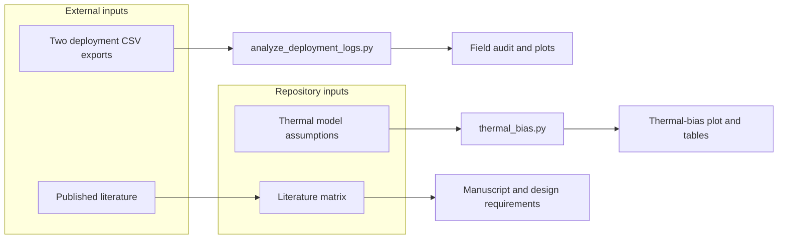

# Data and figure production

This document explains where the repository's reported data come from, how each
result figure is produced, and which parts can be reproduced from the clone
alone.



## Evidence classes

| Class | Meaning in this repository |
| --- | --- |
| Field-log analysis | Calculations made from device exports collected during bench and outdoor operation |
| Analytical simulation | A lumped steady-state heat-balance calculation, without a spatial mesh |
| Literature synthesis | Values extracted or summarized from cited publications |
| Planned analysis | CAD, FEA, calibration, or validation steps that do not yet produce results |

## Deployment-log plots

Generator: [`analysis/analyze_deployment_logs.py`](../analysis/analyze_deployment_logs.py)

Required external files:

- `data1.3_24 - Sheet1.csv` (Log A)
- `data2_5_29 - Sheet1.csv` (Log B)

The script requires an explicit data directory; it has no machine-specific
default. The path below is a placeholder for authorized external exports:

```bash
python analysis/analyze_deployment_logs.py \
  --data-dir /path/to/DataEnclosure \
  --out-dir analysis/output
```

The audit parses timestamps, treats `reset_reason == "BROWNOUT"` as a brownout
row, treats `last_post_ok == 1` as a successful post, replaces battery
temperature sentinels at or below −40, and flags `hum == 0` environmental rows.
An operational row requires `DEEPSLEEP_WAKE` and humidity above zero. The
provisional outdoor window for Log A is 2026-04-20 through 2026-05-11.

That window is retained for exploratory descriptive summaries, not used to
invent configured completeness. Since the 2026-09-05 accounting correction,
completeness is unavailable unless an intended start/end and cadence are
supplied. New output must be kept separate from historical published field
rates until their denominators are reconciled. See [RELIABILITY_METRICS.md](RELIABILITY_METRICS.md).

The command writes `analysis/output/results.md` plus four plots. Three are kept
in `analysis/figures/` under publication-oriented names:

| Committed output | Script output before copy/rename |
| --- | --- |
| `deployment_daily_brownout.png` | `fig1_daily_brownout_fraction.png` |
| `deployment_battv_outcome.png` | `fig3_battv_by_outcome.png` |
| `deployment_temp_window.png` | `fig4_temp_deployment_window.png` |

It also writes filtered CSV subsets beside the raw input under `derived/`.
Those subsets and the source exports are intentionally outside version control.
The script records input SHA-256 prefixes in its generated report so a run can
be tied to specific source files.

## Thermal-bias plot

Generator: [`analysis/thermal_bias.py`](../analysis/thermal_bias.py)

```bash
python analysis/thermal_bias.py
```

The script solves a lumped steady-state energy balance for absorbed solar and
internal heat against convection and long-wave radiation. It converts predicted
sensor temperature rise into relative-humidity error at fixed water-vapor
content, sweeps solar loading and wind speed, and writes
`analysis/figures/thermal_bias.png`.

The assumptions are encoded in the script and tabulated in
[`analysis/thermal_bias_results.md`](../analysis/thermal_bias_results.md). The
model is not fitted to the deployment logs. Its comparison with published
measurements is a literature bracket, not a validation using this enclosure.

## Literature records and report visuals

`literature/literature_matrix.csv`, the bibliography, the cross-source summary,
and `ProConsList/` form the source-traceability layer. Run:

```bash
python analysis/check_literature_coverage.py
```

The files under `deliverables/` and their rendered preview pages are document
layouts built from this material. They are not additional experimental results
and are excluded from the figure manifest.

## Reproduction boundary

The literature coverage check and thermal model run from repository-contained
inputs. Deployment plots require the two external CSV exports. Accuracy,
calibration, heat-soak, and spatial FEA plots cannot be regenerated because
their planned input data or solver implementation do not yet exist.

[`figure-manifest.json`](figure-manifest.json) provides the same figure lineage
in a machine-readable form.
