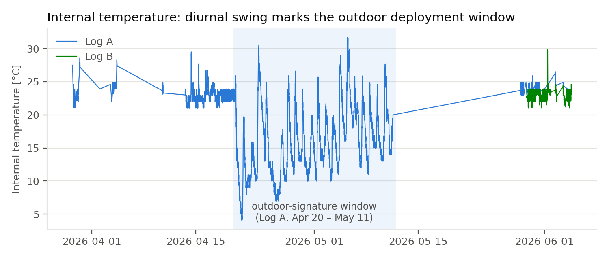
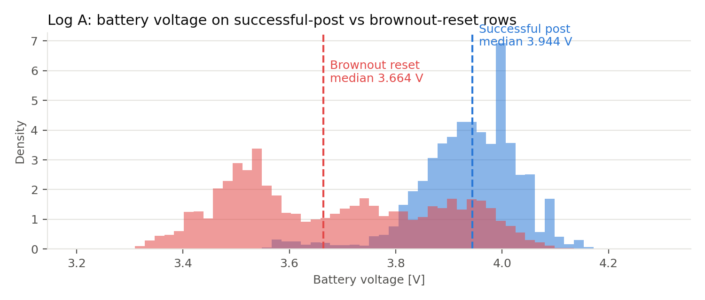
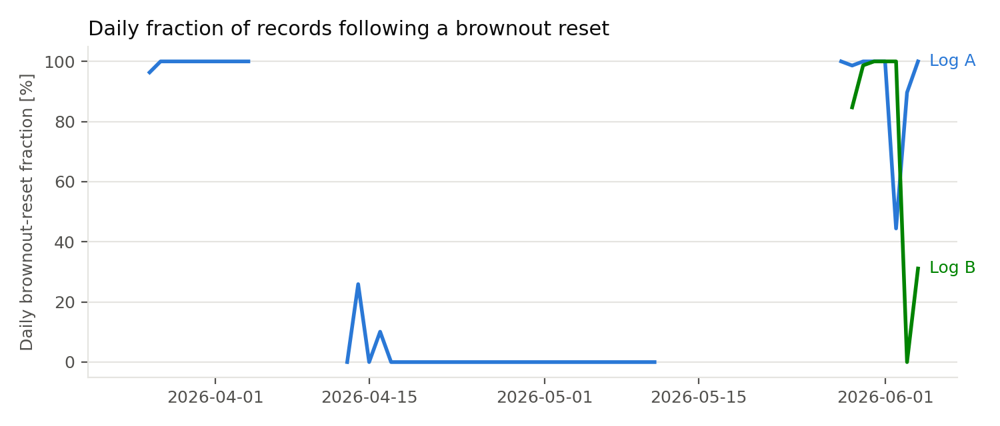

# Results

This page collects the current outputs. It separates deployment-log observations
from analytical predictions because they have different evidence sources and
validation requirements.

## Deployment-log reliability

The first audit uses two CSV exports stored outside this repository. The outdoor
window is inferred from the internal temperature and humidity signature and
still needs confirmation against the deployment record.

For the provisional 22-day outdoor window in Log A, the manuscript reports:

| Metric | Result |
| --- | ---: |
| Upload success | 95.7% |
| Data completeness | 91.4% |
| Brownout resets | 0 |

These values describe delivery and continuity, not measurement accuracy. A
reference co-location dataset is still required for accuracy and calibration
claims.

**Accounting correction, 2026-09-05:** the numbers above are historical,
reported-but-unverified outputs retained for traceability. The former estimator
counted rows over an observed span and unconfirmed six-minute cadence; duplicate
rows and missing edge intervals could inflate completeness. The revised code
requires an explicit intended schedule and counts unique occupied slots. No
revised field percentage has been computed without the private exports and
confirmed provenance. Upload success is a fraction of received records, not
end-to-end delivery probability or wall-clock uptime. See
[metric definitions](RELIABILITY_METRICS.md) and the
[prepared provenance request](DEPLOYMENT_PROVENANCE_REQUEST.md).

| Deployment window | Battery voltage by record outcome |
| --- | --- |
|  |  |

The full audit script defines brownout rows, successful posts, missing-value
sentinels, environmental QC flags, and the operational-row filter. Raw CSVs are
not included, so another user cannot independently regenerate these field plots
without obtaining the source exports.

## Thermal-bias model

The primary comparison includes the inexpensive painted-box control. At
`G = 1000 W/m²`, `wind = 0.5 m/s`:

| Analytical variant | Predicted rise |
|---|---:|
| Dark baseline box | 19.4°C |
| Same modeled box painted white (absorptance 0.90 → 0.30) | 4.5°C |
| Passive shield | 3.0°C |

Thus about 1.5°C of modeled benefit remains relative to the painted baseline,
not the 16.4°C dark-box contrast. The shield also changes geometry, internal
heat coupling, and convection, so this is a system comparison rather than an
isolated shielding effect. Use matched finish and explicit heat-load controls
in the proposed physical comparison. No model parameters or frozen outputs
were changed to produce these already-existing sensitivity results.

At `G = 1000 W/m²` and wind speeds from `0–5 m/s`, the lumped steady-state model
predicts:

| Variant | Temperature rise | Relative-humidity error |
| --- | ---: | ---: |
| Closed baseline box | 8.3–22.7 °C | −18.6 to −35.0 %RH |
| Passive multi-plate shield | 0.9–3.7 °C | −2.5 to −9.4 %RH |
| Actively aspirated reference | about 1.3 °C | about −3.7 %RH |

These are analytical predictions, not measurements or FEA results. Geometry,
surface properties, internal heat, and convection assumptions are listed in
[`analysis/thermal_bias_results.md`](../analysis/thermal_bias_results.md). The
planned heat-soak, co-location, and CHT comparisons are described in
[`docs/cad_fea_plan.md`](cad_fea_plan.md).

## Reading the evidence

| Output | Evidence type | Current limitation |
| --- | --- | --- |
| Deployment metrics and plots | Analysis of external field logs | Raw exports and confirmed deployment history are unavailable in the repository |
| Thermal-bias sweep | First-order analytical simulation | Parameters require lab measurement and co-location comparison |
| Literature brackets | Published measurements summarized from cited sources | Not measurements of this enclosure |
| CAD/FEA plan | Proposed method | Solver pipeline and geometry are not yet complete |

See [`data-and-figures.md`](data-and-figures.md) for the complete production path
and [`figure-manifest.json`](figure-manifest.json) for the machine-readable map.
